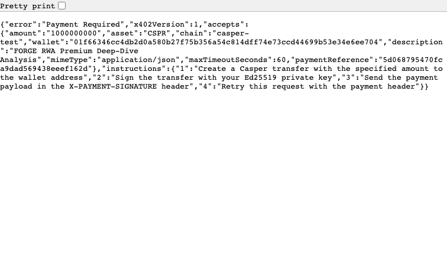

# FORGE x402 — First x402 Payment Protocol for Casper Network

     

> **The first native implementation of the x402 HTTP-402 payment protocol on Casper Network.** An autonomous RWA-analysis AI agent pays for premium on-chain intelligence via micropayments settled directly on Casper Condor 2.0 — no credit card, no off-chain rails, just a signed Ed25519 transfer.

_Built for the **Casper Agentic Buildathon 2026**._

## What This Is

The **FIRST** implementation of the [x402 HTTP payment protocol](https://github.com/x402-foundation/x402) for Casper Network. x402 is an open standard for internet-native payments — it lets AI agents autonomously pay for services via HTTP 402 (Payment Required) responses, settled on-chain.

The x402 Foundation ships packages for EVM, Solana, and Stellar — but **NOT Casper**. FORGE fills that gap, pairing a native x402 client + facilitator with an autonomous **RWA (Real-World Asset) Analysis Agent** that pays for premium on-chain analysis via x402 micropayments (1 CSPR per request).

## Architecture

```
┌──────────────┐         ┌──────────────────┐         ┌──────────────┐
│  RWA Agent   │──── 1 ─▶│  Resource Server │         │  Casper      │
│  (x402       │◀ 402 ───│  Express + MW    │         │  Testnet     │
│   Client)    │──── 2 ─▶│  + Facilitator   │─── 3 ──▶│ (Condor 2.0) │
│              │◀ 200 ───│  + RWA Analyzer  │         │  settlement  │
└──────────────┘         └──────────────────┘         └──────────────┘

1. Agent requests GET /api/rwa-agent/premium → 402 + payment requirements
2. Agent creates Ed25519-signed Casper transfer, retries with X-PAYMENT-SIGNATURE
3. Facilitator verifies → settles on Casper (via casper-client) → returns analysis + receipt
```

## Components

### Off-chain (TypeScript) — Agent + Facilitator

| File | Purpose |
|------|---------|
| `src/facilitator.ts` | Core x402 facilitator: CLValue encoding, payment verification, **real on-chain settlement via `casper-client` subprocess** |
| `src/middleware.ts` | Express middleware: auto 402 → verify → settle → passthrough |
| `src/client.ts` | AI agent x402 client: auto-pays for resources |
| `src/rwa-agent/analyzer.ts` | RWA database (5 asset classes) + pure analysis rules (basic + premium) |
| `src/rwa-agent/agent.ts` | Autonomous RWA agent: routes queries, pays for premium via x402 |
| `src/demo/server.ts` | Demo server with x402-gated premium + free agent endpoints |
| `src/test/` | **24 tests** (facilitator + integration + agent) — all passing |

### On-chain (Rust/WASM) — Casper Settlement Contract

| File | Purpose |
|------|---------|
| `contract/src/main.rs` | Smart contract: idempotent settlement registry, emits events |
| `contract/Cargo.toml` | casper-contract 4.0.0 + casper-types 4.0.2 |
| **Compiled WASM** | 52KB — `contract/target/wasm32-unknown-unknown/release/x402_settlement.wasm` ✅ |

**Contract entry points:** `init()`, `settle(payment_reference, payer, amount, deploy_hash)` (idempotent), `get_settlement(payment_reference)`, `get_count()`.

## Quick Start

### Off-chain (TS facilitator + RWA agent + demo server):
```bash
npm install
npm run build
npm test        # 24 tests pass
npm run demo    # Start demo server on :3000
```

### Full end-to-end feature walkthrough (for recording the demo video):
```bash
./scripts/demo.sh        # boots the server + hits every endpoint with annotated output
```
See **[SUBMISSION.md](./SUBMISSION.md)** for the full project overview, architecture, and demo guide.

### On-chain (Rust contract → WASM):
```bash
cd contract
cargo build --release --target wasm32-unknown-unknown
# Produces: target/wasm32-unknown-unknown/release/x402_settlement.wasm (52KB)
```

### Deploy to Casper Testnet (Condor 2.0):
```bash
casper-client keygen .keys                                    # generate keypair
# Fund the public key via the faucet (GitHub login): https://testnet.cspr.live/
./scripts/deploy-contract.sh                                  # deploys + writes .deploy.env
```

## Testnet Integration Status

| Item | Status |
|------|--------|
| casper-client 5.x installed | ✅ |
| Testnet RPC reachable | ✅ `https://node.testnet.casper.network/rpc` (api 2.0.0 / protocol 2.2.1) |
| Keypair generated | ✅ `.keys/` |
| Resource-server wallet | ✅ `01f66346cc4db2d0a580b27f75b356a54c814dff74e73ccd44699b53e34e6ee704` |
| Contract deploy | ⏳ **Blocked on faucet funding** — `scripts/deploy-contract.sh` is ready to run; the testnet faucet requires a GitHub login (human step). Run it once funded. |
| `settlePayment()` → real Casper | ✅ Implemented (shells out to `casper-client put-deploy`); goes fully live the moment the account is funded + contract installed. |

> **Note:** `settlePayment()` is production-ready and uses the `casper-client` binary for cryptographically-correct deploy serialization + Ed25519 signing on Casper Condor 2.0. The only thing between "demo mode" and "fully live on testnet" is funding the faucet + running the deploy script.

## API Endpoints

| Endpoint | Auth | Description |
|----------|------|-------------|
| `GET /` | free | Service info + endpoint map |
| `GET /api/rwa-list` | free | List all RWAs |
| `GET /api/rwa-agent/ask?q=...` | free | Agent routes a natural-language query |
| `GET /api/rwa-agent/portfolio` | free | Basic analysis across all RWAs |
| `GET /api/rwa-agent/premium?asset=ID` | **x402** | Premium deep-dive (1 CSPR) |
| `GET /api/analyze-rwa?asset=ID` | **x402** | Full RWA analysis (1 CSPR) |
| `GET /health` | free | Health check |

### RWA catalogue (5 asset classes)
`real-estate-001` (Real Estate), `commodity-003` (Gold), `invoice-002` (Invoice Financing), `treasury-004` (T-Bill), `carbon-005` (Carbon Credits).

## x402 Payment Flow

```bash
# Without payment → 402
curl http://localhost:3000/api/rwa-agent/premium?asset=commodity-003
# { "error":"Payment Required", "accepts": { "scheme":"x402", "asset":"CSPR", "amount":"1000000000", ... } }

# Agent pays 1 CSPR → facilitator settles on Casper → returns premium analysis + receipt
```

## Docker
```bash
docker compose up --build      # app on :3000 + casper-client sidecar
```

## Tech Stack
- **TypeScript** — off-chain agent + facilitator
- **Rust → WASM** — Casper settlement contract (Condor 2.0)
- **casper-client 5.x** — deploy serialization + Ed25519 signing
- **Express** — resource server middleware
- **x402 Protocol** — HTTP 402 payment standard

## 📸 Screenshots
| Dashboard | x402 Payment Flow |
|---|---|
|  |  |

## License
MIT
